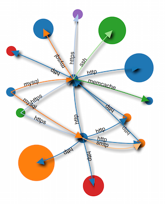

FoggShark
===

Get an overview of what a system connects to just by running [tcpdump](http://www.tcpdump.org) on one or more machines on the network.

Collecting tcpdump data
===

On as many servers as you want, run this command for a long as you want. The more servers and time, the more detailed the graph.

     sudo tcpdump -nnl 'tcp[13] == 2' | perl -ne '$|=1;/([\d.]+)\.(\d+) > ([\d.]+)\.(\d+)/;$f=$1;$t=$3;$p=$4;if($4>30000){$f=$3;$t=$1;$p=$2;}$o="$f>$t:$p\n";if(!$s{$o}){$s{$o}=1;print$o;}'> `hostname`.log

The command above runs [tcpdump](http://www.tcpdump.org) configured to report only new connections and pipes it to a perl script to format the output nicely and remove duplicates.

Drawing the graph
===

You need nodejs and npm, then run:

     npm install -g foggshark

Download the log files from all the machines into one directory and run

     cat *.log | foggshark

Wait for the script to finish looking up the DNS entries for the hosts and then open http://127.0.0.1:8000 where your graph should be waiting. To disable DNS lookups (which can take some time) use foggshark -n

You can move around nodes on the graph to see things better. The hosts in the graph are grouped such that hosts which connect only to one other host on the same port are grouped together by port. Mouse over the nodes to reveal which hosts are in the group. The links are colour coded by port and the size of nodes reflects the number of hosts in the group.
